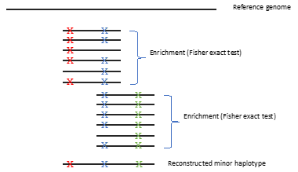

.. _Pandas: https://pandas.pydata.org/
.. _Numpy: https://numpy.org/
.. _Scipy: https://www.scipy.org/

Haplotype inference
===================
Sometimes variants are linked on the same genome. Since Illumina uses short reads, if variants that are present on the same genome 
are too distant it is impossible to infer the linkage. But, if linked variants are proximal, it is possible to infer this linkage
by looking at the fraction of reads with both variants present, compared to reads where only one variant or no variant is present.
By performing statistical tests for independence on the two variants it is possible to "link" them to the same genome (at least,
to a certain frequency within the population). After pairs of loci were linked, if haplotypes do not share variants, it is possible
to merge several pairs together to a longer haplotype.

.. warning:: 
    If the population is too heterogeneous (that is, many divergent sequences of the
    same genomic region are present), the haplotypes inference is expected to be 
    inaccurate due to possible sharing of variants between different strains.

	
    Schematic of haplotype inference script.

Prerequisites
^^^^^^^^^^^^^
This flow requires `Pandas`_, `Numpy`_ and `Scipy`_ python packages installed. 

Finding pairs of linked loci
^^^^^^^^^^^^^^^^^^^^^^^^^^^^
In order to find pairs of linked loci, it is required to first run the AccuNGS 
:doc:`basecall` stage. An intermediate of this stage is a file with the suffix 
``.good_reads.mutations.list``. This file lists all individual mutations found 
for each read. By combining this file with the BLAST results file (to obtain 
the number of mutations covering each two loci), it is possible to generate a 
contingency table for all pairs of variants and then test for independence, 
using Fisher's exact test. The python script ``variants_on_same_read.py`` 
accepts the two input files and outputs a file with all combinations of two 
sites, the counts of all variants and the results of the independence tests, 
along with an associated p-value. 

Required parameters
*******************

===================== ================ ================================ 
Parameter name        Type             Description
===================== ================ ================================
blast_output          String           The output of the blast step of :doc:`basecall` stage
--------------------- ---------------- --------------------------------
mutation_list         String           The list file with the suffix ``.good_reads.mutations.list`` obtained during base calling step of :doc:`basecall` stage
--------------------- ---------------- --------------------------------
pos                   Integer          The position ``x`` to consider all possible pairs between ``x`` and positions in the interval (x, x+250]
--------------------- ---------------- --------------------------------
freqs_file            String           The output of :doc:`basecall` stage
===================== ================ ================================

Usage
*****

.. code-block:: bash

  python haplotypes/variants_on_same_read.py ${blast_output} ${mutation_list} ${pos} ${freqs_file} > pos_${pos}.txt

Output
******
The output of this step is a comma-separated file with five columns:

====================== ================ ================================ 
Parameter name         Type             Description
====================== ================ ================================
first_pos (column 1)   Integer          The ``${pos}`` input
---------------------- ---------------- --------------------------------
second_pos (column 2)  Integer          The second position in the pair. Always greater than ``first_pos``
---------------------- ---------------- --------------------------------
odds_ratio (column 3)  Float            The prior odds ratio
---------------------- ---------------- --------------------------------
p_value (column 4)     Float            The p-value for seeing this result if the two variants are independent
---------------------- ---------------- --------------------------------
frequency (column 5)   Float            The frequncy of reads from all reads covering ``first_pos`` and ``second_pos`` with two variants
====================== ================ ================================

Linked pairs to haplotypes
^^^^^^^^^^^^^^^^^^^^^^^^^^
Once two loci were linked to the same genome (and to a given frequency), if one
locus is also linked with another locus it is possible to merge the two pairs 
together to a longer haplotype. This can be done iteratively over all pairs to 
generate long haplotypes, which are a collection of variants that are presumably 
on the same haplotype (under the assumption that different haplotypes in the 
sample do not share variants).

Usage
*****

The python script ``haplotypes/co-occurs_to_stretches.py`` allows merging pairs
of linked variants to longer (partial) haplotypes. 
It requires the output of the linked pairs step, for all positions, as a single file. 
Example usage:

.. code-block:: bash

  python haplotypes/co-occurs_to_stretches.py linked_pairs.txt

Required parameters
*******************

The ``obtain_comutations`` function accepts three parameters:

===================== ================ ================================ 
Parameter name        Type             Description
===================== ================ ================================
linked_pairs          String           Path to a file with all linked pairs identified using ``variants_on_same_reads.py``
--------------------- ---------------- --------------------------------
``-o / --out``        String           The output file path. Defaults to ``linked_pairs.stretches.out``
--------------------- ---------------- --------------------------------
``-p / --max_pval``   Float            The maximum p-value to consider a pair as valid
--------------------- ---------------- --------------------------------
``-d / --distance``   Float            The distance between the frequencies of two pairs to consider them both on the same haplotype
===================== ================ ================================

Output
******
The output is a tab-delimited file similar to :download:`this example output file <examples/example.stretches.out>`. 
Its columns are the following:

===================== ================ ================================ 
Column name           Type             Description
===================== ================ ================================
Pos1                  Integer          First position in pair
--------------------- ---------------- --------------------------------
Pos2                  Integer          Second position in pair
--------------------- ---------------- --------------------------------
Freq                  Float            The frequency that ``Pos1`` and ``Pos2`` variants were linked, from all reads mapped with both positions
--------------------- ---------------- --------------------------------
Stretch               Integer          The index of this stretch, starting from 0 and above. Stretches are ordered by their ``meandist``, descending
--------------------- ---------------- --------------------------------
meandist              Float            The mean ``Freq`` for all pairs participating in ``Stretch``
===================== ================ ================================
