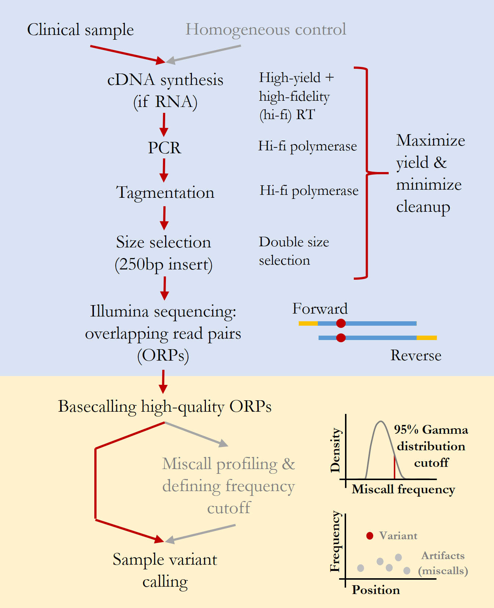

Overview
========

AccuNGS is a sequencing approach aimed at accurate deep sequencing of DNA or RNA,
especially with long genomic regions and low input that often requires amplification. 
It is composed of several techniques that eliminate most errors that are 
created during library prep and sequencing. 

AccuNGS's sequencing principles
^^^^^^^^^^^^^^^^^^^^^^^^^^^^^^^ 
The main idea behind this approach is to reduce the error sources to a minimum. 
This is achieved by adhering to the following principles:

* High-yield reverse transcription reactions (RT) [if required]
* High-fidelity PCR reactions [if required]
* High-fidelity tagmentation 
* Size selection for insert size that equals read size
* Illumina paired-end sequencing
* Sequencing of a homogeneous control sample for fitting substitution-specific distributions of errors

	
    AccuNGS principles.

Exact equipment and materials used are described in :ref:`cite`. 

AccuNGS - code
^^^^^^^^^^^^^^
The code accompanying AccuNGS is divided into several parts, each carrying a different stage
in the computational analysis of sequencing output. The different flows are:

* :doc:`basecall`
* :doc:`variants`
* :doc:`haplotypes`
* :doc:`barcodes`

